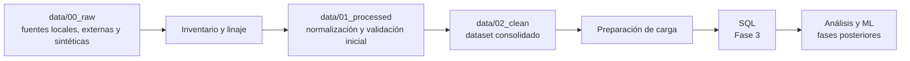

# 2.2 Diseño de arquitectura de datos

## Estado

Completado.

## Flujo general



## Capas

| Capa | Ubicación | Función | Salida |
|---|---|---|---|
| Raw | `data/00_raw/` | Conservar las fuentes originales | Entradas del pipeline |
| Inventario | `data/01_processed/data_inventory.csv` y `data_lineage.csv` | Registrar fuentes, origen y recorrido | Catálogo y linaje |
| Processed | `data/01_processed/` | Normalizar formatos, tipos, unidades y estructuras | Datos procesados |
| Clean | `data/02_clean/` | Consolidar datos validados y listos para análisis | Dataset clean |
| SQL | `docs/02_ingenieria_datos/sql/` y base local | Recibir datos preparados y permitir consultas | Tablas consultables |

## Entradas

- Fuentes locales de Guadalajara.
- METR-LA y PEMS-BAY.
- Metadatos de sensores externos.
- Datos sintéticos únicamente para pruebas técnicas.

Cada entrada conserva `fuente`, ciudad, tipo de dato y estado de realidad. La investigación anterior no es una dependencia del pipeline nuevo.

## Transformaciones

1. Leer desde `data/00_raw/`.
2. Registrar la fuente y la ejecución.
3. Estandarizar columnas, tipos y timestamps.
4. Convertir fuentes anchas a formato largo cuando corresponda.
5. Validar registros y separar rechazos.
6. Consolidar datos compatibles.
7. Preparar las estructuras que pasarán a SQL.

## Organización del código

```text
docs/02_ingenieria_datos/
├── 01_inventario_linaje/
├── 02_arquitectura_datos/
├── 03_pipeline_raw_processed/
├── 04_estandarizacion_normalizacion/
├── 05_calidad_validacion/
├── 06_integracion_consolidacion/
├── 07_dataset_clean/
├── 08_preparacion_sql/
├── 09_pipeline_carga_sql/
├── 10_reproducibilidad_trazabilidad/
├── 11_validacion_final_tuberia/
└── sql/
```

Los datos generados permanecen en `data/`; la documentación y los scripts de cada subfase permanecen en su carpeta correspondiente.

## Límites entre fases

- La Fase 2 prepara, valida y entrega los datos.
- La Fase 3 define formalmente tablas, relaciones, índices y consultas SQL.
- Las fases de análisis y ML consumen el dataset clean o SQL.
- La interfaz consume resultados aprobados y no ejecuta limpieza ni entrenamiento.

## Entregable

Diagrama, capas, entradas, transformaciones, salidas y límites de la arquitectura documentados.
